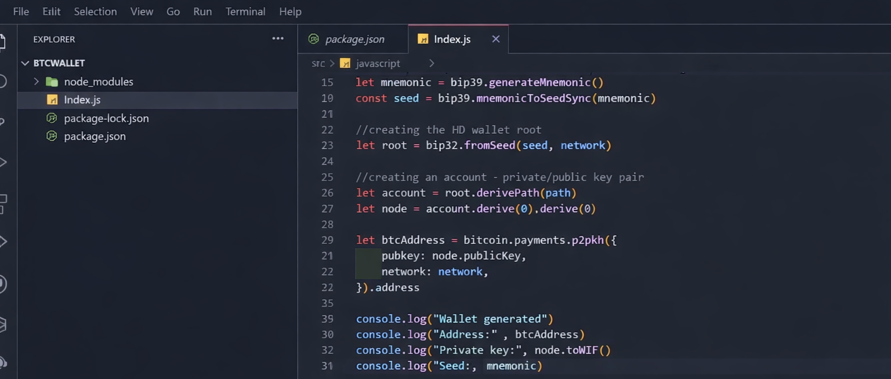
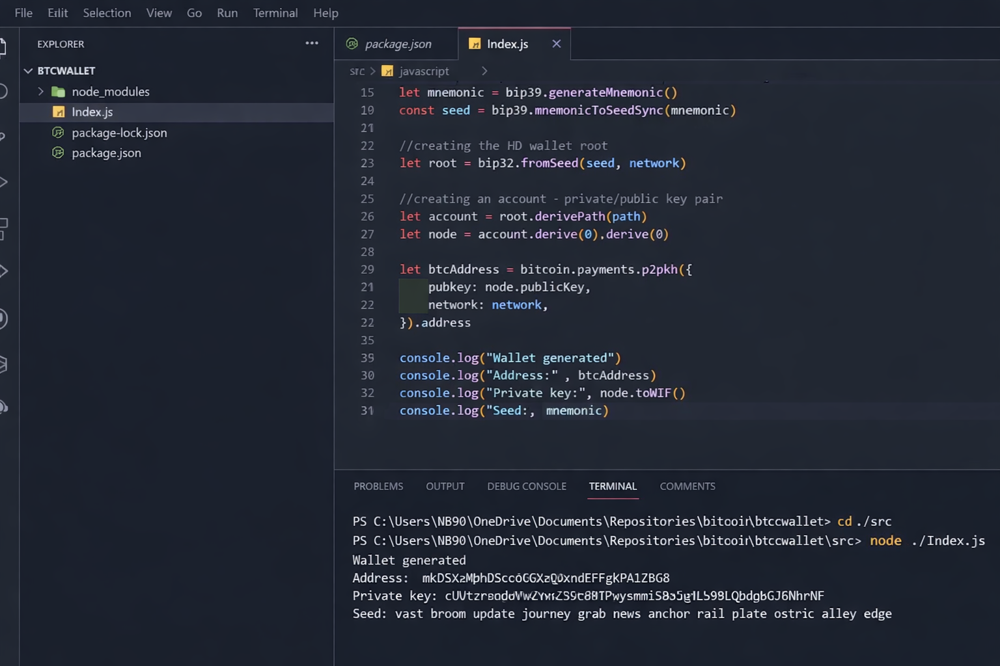
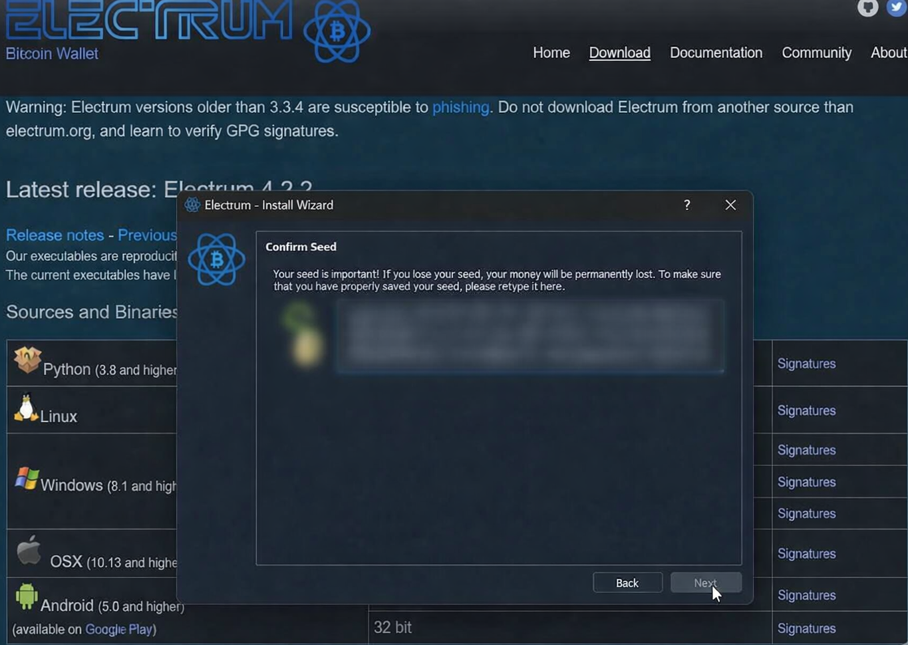
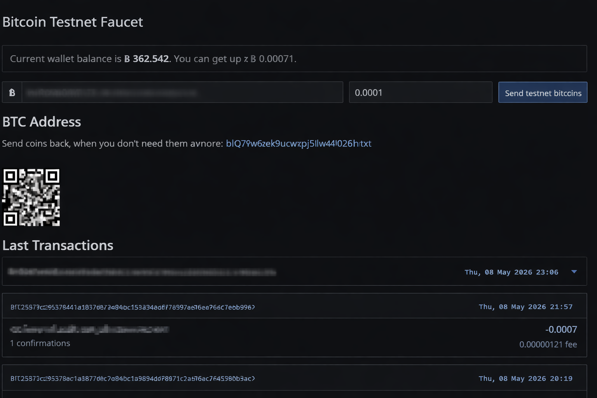

Daily learning

# Creating and Using Your Cryptocurrency Wallet

Project developed at the Bootcamp Blockchain Specialist Training, under the guidance of specialist [Cassiano Peres](https://github.com/cassianobrexbit/ "Cassiano Peres").

In this challenge, we will create a bitcoin wallet generator using public and private key pairs.
You will develop a generator to create deposit and send bitcoin addresses for the generated wallet.
Additionally, we will import this wallet into Electrum, a desktop application for sending and receiving bitcoin transactions,
and finally, send cryptocurrencies.

- Developing a bitcoin wallet generator

- Creating deposit addresses and sending Bitcoin and private key

- Importing wallet for Electrum

- Sending cryptocurrencies

[LICENSE](/LICENSE)

See [original repository](https://github.com/cassianobrexbit/bitcoin-dio)
